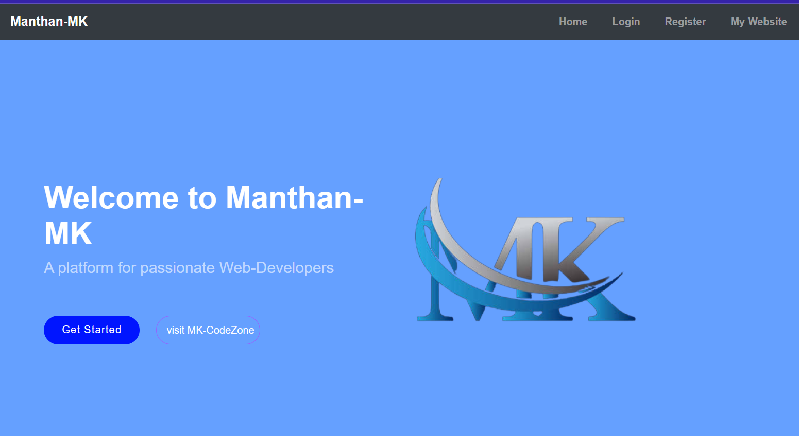

# MK-Backend Web App

=> MK-Backend Web App is a backend app built with Javascript and it's server is built with Express.js. It has Signup and Login page where user's credentials will be stored in my MongoDB-Atlas Database.

## Website Link => https://manthan-mk-web.onrender.com/

## Project's Screenshots =>




<h2>Getting Started</h2>

1. To get started with this project, you will need to have `Node.js` and `NPM` installed on your system.

2. First, you need to open a `Terminal` in your system and `Clone` this repository by using :

```bash
git clone https://github.com/Mk4Levi/Manthan-MK-WebApp.git
```

3. Navigate to the Project's directory :

```bash
cd Manthan-MK-WebApp
```

4. Install all Dependencies used in this Project :

```bash
npm install
```

5. Finally, host it on local server :

```bash
node app.js
```

6. Now just search this in your browser to view the live running application in your Local sysytem :

```bash
http://localhost:3000
```

<h2>Paths & Files</h2>

### Structure of the Folders & Files in this Repo :

```text
.
├── public
│     └──images
|     └──css
├── src
│     └──db
|     └──models
|     └──app.js
├── templates
│     └── partials
|         └──footer.hbs
|         └──header.hbs
|         └──navbar.hbs
|     └── views
│         └──aboutmk.hbs
|         └──index.hbs
│         └──login.hbs
|         └──register.hbs
├── .eslintrc.json
├── .gitattributes
├── .gitignore
├── package-lock.json
├── package.json
├── README.md
```

# Thank You
